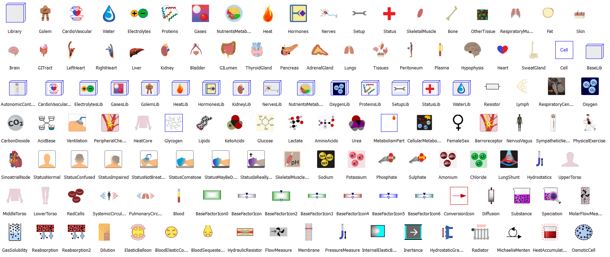

# Physiolibrary

Physiolibrary is a free open-source Modelica library designed for modeling human physiology. 
This library contains basic physical laws governing human physiology, usable for cardiovascular circulation,
metabolic processes, nutrient distribution, thermoregulation, gases transport, electrolyte regulation, 
water distribution, hormonal regulation and pharmacological regulation.

## Library description

The origin of this Modelica Physiolibrary was in the first version of our HumMod Golem Edition model implementation,
where it was called HumMod.Library. As the successors of Guyton's Medical Physiology School write, 
the original HumMod model is “The best, most complete, mathematical model of human phys-iology ever created” ( http://hummod.org ).

We are also developing many types of smaller physiological models for use in medical education, 
so it was essential to separate this library from our HumMod Modelica implementation. This separation improves 
the quality of the next HumMod release and provides a useful Modelica library to modelers in this bioscience.
The library contains only carefully-chosen elementary physiological laws, which are the basis of more complex physiological
processes. For example from only two type of blocks (Chemical.ChemicalReaction and Chemical.Substance) it is 
possible to compose the allosteric transitions or the Michaelis-Menten equation.

Library contains also the icons for higher level (HumMod) subsystem implementations:

## Installation
Download the current release. Unzip it. 
For Dymola users: execute \Resources\DymolaSettings\"installDisplayUnits.bat" which will copy the .

To unistall this support of display units please run generated "uninstallDisplayUnit.bat".

If new version of Dymola is installed please run "uninstallDisplayUnit.bat" first, if exists!

## Current release

Download [Physiolibrary 2.0.2 (2014-01-26)](../../archive/v2.0.2.zip)

#### Release notes

*  [Version v2.0.2 (2014-01-26)](../../archive/v2.0.2.zip)
 * Support for steady states calculation by energy/mass conservation laws or enviroment sources
 * Conditional inputs for each domain blocks
 * Package States renamed to SteadyStates, added SteadyStates.Components
 * Removed package Mixed
 * Package FileUtilities moved to Types.FileUtilities

*  [Version v1.2.0 (2014-01-15)](../../archive/v1.2.0.zip)
 * Package structure Physiolibrary.{domain}.[Examples|Components|Sources|Interfaces].{component}
 * New icons
 * Thermal: Relative heat energy to normal body temperature (37degC) 
 * New examples: 
	Guyton-Coleman-Granger cardiovascular model, 
	Coleman thermal energy transfers

*  [Version v1.1.0 (2013-12-30)](../../archive/v1.1.0.zip)
 * Heat connector compatibility between Physiolibrary.Thermal package and Modelica.Thermal.HeatTransfer package (MSL 3.2)
 * Some English language corrections
 * Hydrostatic pressure patch
 * New examples 
 
*  [Version v1.0.1 (2013-12-11)](../../archive/v1.0.1.zip)
 * The library uses the Modelica Standard Libary (MSL) version 3.2.
 * Contains nice physiological icons.
 * Support for physiological units: min,kcal,mmHg,ml,mEq,.. 
 * Base blocks for chemical, hydraulical, osmotic, thermal or mixed domains
 * Support of euilibrated systems
 * Support for expandable inputs/outputs/tests lists 

## License

This Modelica package is free software and the use is completely at your own risk;
it can be redistributed and/or modified under the terms of the [Modelica License 2](https://modelica.org/licenses/ModelicaLicense2).

## Development and contribution
Release manager: [Marek Matejak](http://www.physiome.cz)
Contributor: [Tomas Kulhanek] (https://github.com/TomasKulhanek)

You may report bugs or issues to e-mail: marek\<at\>matfyz\<dot\>cz

