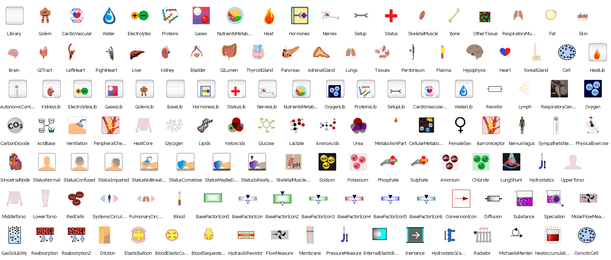

# Physiolibrary

Physiolibrary ( http://www.physiolibrary.org ) is a free open-source Modelica library designed for modeling human physiology.
This library contains basic physical laws governing human physiology, usable for cardiovascular circulation,
metabolic processes, nutrient distribution, thermoregulation, gases transport, electrolyte regulation,
water distribution, hormonal regulation and pharmacological regulation.

## Library description

The origin of this Modelica Physiolibrary was in the initial version of our Physiomodel ( http://www.physiomodel.org ) implementation, which is based on model of human physiology called HumMod. As the successors of Guyton's Medical Physiology School write, the original HumMod model is “The best, most complete, mathematical model of human physiology ever created” ( http://hummod.org ).

We are also developing many types of smaller physiological models for use in medical education,
so it was essential to separate this library from our HumMod Modelica implementation. This separation improves
the quality of the next HumMod release and provides a useful Modelica library to modelers in this bioscience.
The library contains only carefully-chosen elementary physiological laws, which are the basis of more complex physiological
processes. For example from only two type of blocks (Chemical.ChemicalReaction and Chemical.Substance) it is
possible to compose the allosteric transitions or the Michaelis-Menten equation.

Library contains also the icons for higher level (HumMod) subsystem implementations:

## Installation
* Physiolibrary/package.mo can be directly opened by each Modelica environments. 

* OpenModelica: Physiolibrary is already included from version 1.9.

* Dymola support of physical units:
  * Using Windows batch script: call "Physiolibrary\Resources\Install\Dymola\install.bat"
  * Manually: copy the Physiolibrary/Resources/DisplayUnits/displayUnits.mos over dymola-install-dir/insert/displayUnits.mos

## Prerequisities

* Chemical library 1.4 or higher. To include right version of Chemical library as git submodule use "git clone --recursive" (or "git submodule update" for existing repositories).
* environment supporting Modelica 3.2 or higher ([Dymola](http://www.3ds.com/products-services/catia/capabilities/modelica-systems-simulation-info/dymola/trial-version/), [OpenModelica](https://build.openmodelica.org/omc/builds/windows/releases/), [SystemModeler](http://www.wolfram.com/system-modeler/trial/) or [JModelica](http://www.jmodelica.org/binary))
* Modelica Standard Library 3.2.1 ([MSL](https://github.com/modelica/Modelica))

## Current release

Download [Physiolibrary 3.0.0 (2023-10-09)](../../archive/v3.0.0.zip)

#### Release notes

*  [Version v3.0.0 (2023-10-09)](../../archive/v3.0.0.zip)
 * using Chemical 1.4 instead of Physiolibrary.Chemical and Physiolibrary.Osmotic
 * support of Modelica.Fluid and Modelica.Media concept instead of Physiolibrary.Hydraulic
 * model of Blood using blood plasma and red cells composition with Henderson-Hasselbalch;Hemoglobin-O2,CO2,H+,CO binding;Chloride shift;Osmosis
 * support of modeling of respiratory and cardiovascular blood gases transport
 * obsolete previous Physiolibrary steady state concept

*  [Version v2.3.1 (2015-09-15)](../../archive/v2.3.1.zip)
 * Change of license to [BSD](http://opensource.org/licenses/BSD-3-Clause): 
		* no additional restricions 
		* supported decentralized development
 * Fixed external pressure in elastic vessel compertment
 * New example of pulsative blood circulation by Willem van Meurs 2011
 * Support of [Physiomodel 1.0.0] (https://github.com/physiology/Physiomodel/releases/tag/v1.0.0)

*  [Version v2.3.0 (2015-02-16)](../../archive/v2.3.0.zip)
 * New:
		* Population domain for population models of organisms, cells,..
		* cardiovascular models as example of Hydraulic domain
		* components: osmotic reabsorption, ideal osmotic flow filtration
		* display units: umol/min,nmol/min,pmol/min,l/day
		* icons: heart ventricle icon, microcirculation, population
		* blocks: 1(one) as constant, energy per mass, DegradationGain, FractionGain
		* installation to System Modeler script (Resources/Install)
 * Fix:
		* OsmoticCell with more possible membrane type interfaces
		* factors: dissabling option and with decadic logarith
		* redefinition of unmeasurables physical quantities
		* manipulation with initial input and final output values of variables
		* units of heart starling slopes in CardiovascularSystemGCG example
 * Rename:
		* units Torr with capital 'T' (from name - Evangelista Torricelli)
		* Blocks.Math.Exponentiation to Blocks.Math.Power

*  [Version v2.2.0 (2014-09-06)](../../archive/v2.2.0.zip)
 * New read/write of values in non-SI units from/to file
 * New outflow/inflow sources
 * New chemical internal heats
 * New passive fluxes through membranes
 * Fixed collapsing ElasticVessel at negative sucking pressures
 * Fixed concentrations are always per volume of whole solution
 * Fixed determining of Dymola installation folder
 * Renamed actualFlow, actualConc, .. in sensors
 * Renamed FlowConcentrationMeasure to IncrementalFlowConcentrationMeasure
 * Renamed thermal OutStream to MassOutflow

*  [Version v2.1.1 (2014-05-02)](../../archive/v2.1.1.zip)
 * New compoment: HydraulicComponents.IdealValve for modeling aortic, pulmonary, triscupid and mitral valve
 * New types: pH, VolumeDensityOfCharge
 * New examples: Osmotic.Examples.CelebrospinalFluid, Hydraulic.Examples.Windkessel and Hydraulic.Example.MinimalCirculation
 * Fix: role of hydraulic pressure in Osmotic.Components.Membrane

*  [Version v2.1.0 (2014-02-28)](../../archive/v2.1.0.zip)
 * Upgrade to MSL 3.2.1 (still compatible with MSL 3.2)
 * New: constants HydraulicResistanceConst, HydraulicElastanceConst and HydraulicElastanceToComplianceConst and type HydraulicElastance
 * New: steady state component ElectricChargeConservationLaw
 * New: display units for hydraulic resistance/conductance/compliance/elastance, for gas solubility
 * Rename:  HydraulicResistanceConst to HydraulicResistanceToConductanceConst
 * Fix: gas solution in liquid with corrected GasSolubility type
 * Fix: bidirectional stream flows
 * Fix: steady state example of dissolved oxygen
 * Fix: installation batch file for Dymola in Windows
 * Fix: references in overview (user's guide)

*  [Version v2.0.2 (2014-01-26)](../../archive/v2.0.2.zip)
 * Support for steady states calculation by energy/mass conservation laws or environment sources
 * Conditional inputs for each domain blocks
 * Package States renamed to SteadyStates, added SteadyStates.Components
 * Removed package Mixed
 * Package FileUtilities moved to Types.FileUtilities

*  [Version v1.2.0 (2014-01-15)](../../archive/v1.2.0.zip)
 * Package structure Physiolibrary.{domain}.[Examples|Components|Sources|Interfaces].{component}
 * New icons
 * Thermal: Relative heat energy to normal body temperature (37degC)
 * New examples:
	Guyton-Coleman-Granger cardiovascular model,
	Coleman thermal energy transfers

*  [Version v1.1.0 (2013-12-30)](../../archive/v1.1.0.zip)
 * Heat connector compatibility between Physiolibrary.Thermal package and Modelica.Thermal.HeatTransfer package (MSL 3.2)
 * Some English language corrections
 * Hydrostatic pressure patch
 * New examples

*  [Version v1.0.1 (2013-12-11)](../../archive/v1.0.1.zip)
 * The library uses the Modelica Standard Library (MSL) version 3.2.
 * Contains nice physiological icons.
 * Support for physiological units: min,kcal,mmHg,ml,mEq,..
 * Base blocks for chemical, hydraulical, osmotic, thermal or mixed domains
 * Support of equilibrated systems
 * Support for expandable inputs/outputs/tests lists

## License (BSD 3-Clause)

Copyright (c) 2008-2023, Marek Mateják, Charles University in Prague

All rights reserved. 

Redistribution and use in source and binary forms, with or without modification, are permitted provided that the following conditions are met: 

1. Redistributions of source code must retain the above copyright notice, this list of conditions and the following disclaimer. 
2. Redistributions in binary form must reproduce the above copyright notice, this list of conditions and the following disclaimer in the documentation and/or other materials provided with the distribution. 
3. Neither the name of the copyright holder nor the names of its contributors may be used to endorse or promote products derived from this software without specific prior written permission. 

THIS SOFTWARE IS PROVIDED BY THE COPYRIGHT HOLDERS AND CONTRIBUTORS "AS IS" AND ANY EXPRESS OR IMPLIED WARRANTIES, INCLUDING, BUT NOT LIMITED TO, THE IMPLIED WARRANTIES OF MERCHANTABILITY AND FITNESS FOR A PARTICULAR PURPOSE ARE DISCLAIMED. IN NO EVENT SHALL THE COPYRIGHT HOLDER OR CONTRIBUTORS BE LIABLE FOR ANY DIRECT, INDIRECT, INCIDENTAL, SPECIAL, EXEMPLARY, OR CONSEQUENTIAL DAMAGES (INCLUDING, BUT NOT LIMITED TO, PROCUREMENT OF SUBSTITUTE GOODS OR SERVICES; LOSS OF USE, DATA, OR PROFITS; OR BUSINESS INTERRUPTION) HOWEVER CAUSED AND ON ANY THEORY OF LIABILITY, WHETHER IN CONTRACT, STRICT LIABILITY, OR TORT (INCLUDING NEGLIGENCE OR OTHERWISE) ARISING IN ANY WAY OUT OF THE USE OF THIS SOFTWARE, EVEN IF ADVISED OF THE POSSIBILITY OF SUCH DAMAGE.

## Development and contribution
Release manager: [Marek Matejak](http://github.com/MarekMatejak)

Contributor: 
 [Marek Matejak](http://github.com/MarekMatejak),
 [Tomas Kulhanek](https://github.com/TomasKulhanek), 
 [tbeu](https://github.com/tbeu)

You may report bugs or issues to [project issues](https://github.com/MarekMatejak/Physiolibrary/issues) or to e-mail: marek\<at\>matfyz\<dot\>cz

